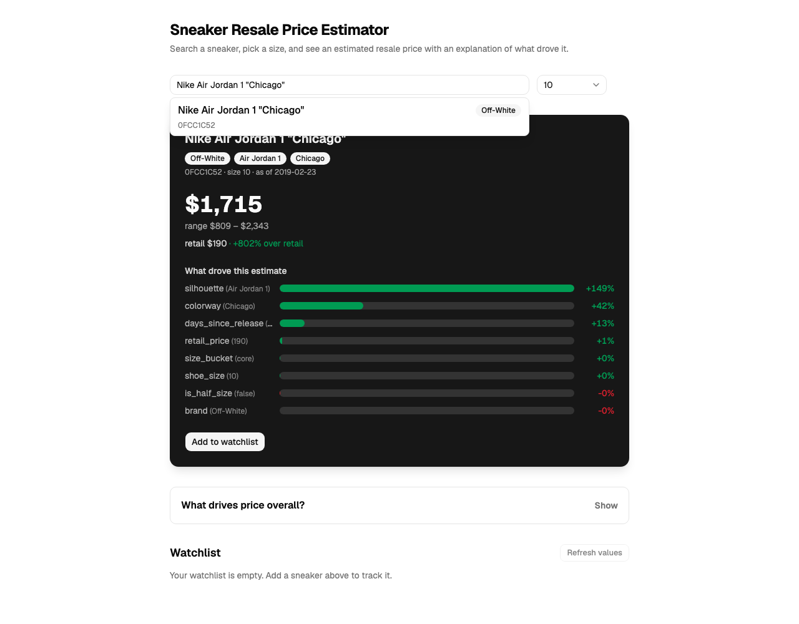
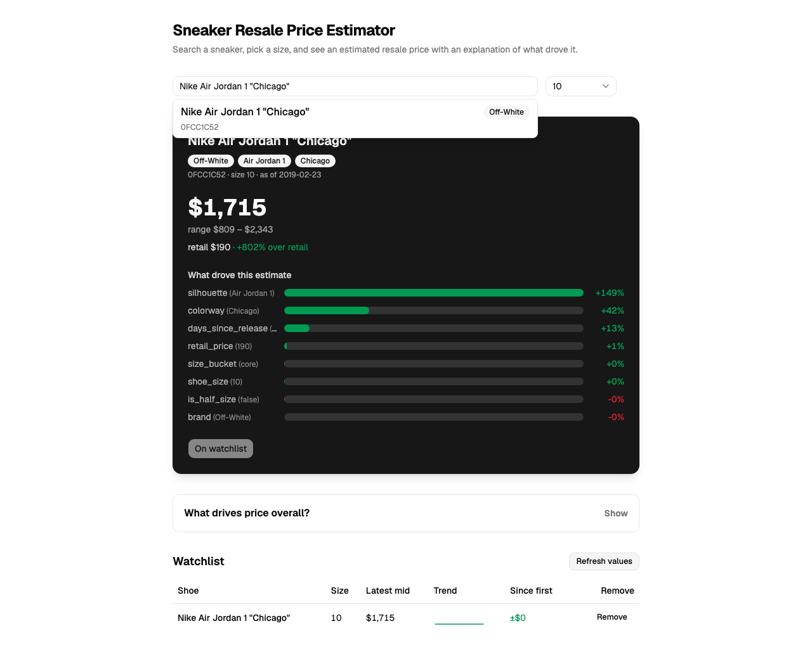
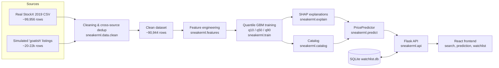

# Sneaker Resale Price Estimator

A teaching project that turns "what's this pair worth?" from vibes into a
number you can defend. Sneaker resale pricing is normally guessed from
listing scrolls and gut feel; this project trains a model on ~91k real
StockX sales, serves a **price range with an explanation** (not a single
point guess), and wraps the whole thing in a searchable web app with a
price-tracking watchlist.

The point isn't "the model is right" — it's showing, end to end, how a
resale price estimate gets built: messy multi-source data → cleaning and
dedup → feature engineering → quantile regression with an honest temporal
evaluation → SHAP explanations → an API → a UI. Every one of those steps
has a matching notebook or test you can open and re-run.

## Quickstart

```bash
git clone <this-repo-url> ml-sneaker-resale-price-estimator
cd ml-sneaker-resale-price-estimator
make all
```

`make all` creates a Python venv, installs backend + frontend
dependencies, downloads the real ~99,956-row StockX CSV, generates a
simulated second-marketplace source, cleans/dedupes both into one
~90,944-row dataset, trains three quantile GBM models, builds the shoe
catalog, runs the full pytest suite, executes all three teaching
notebooks in place, and builds the frontend. **On a fresh clone this
takes about 2 minutes** on a modern laptop with a reasonable network
connection (most of that is `pip install`; the ML pipeline itself trains
in seconds since the dataset is small by ML standards).

Then, in two terminals:

```bash
make api   # Flask API on http://127.0.0.1:5000
make web   # Vite dev server on http://localhost:5173
```

Open **http://localhost:5173**, search for a sneaker (e.g. "jordan" or
"beluga"), pick a size, and you'll get a price range with a breakdown of
what drove it:



Add it to your watchlist and click "Refresh values" to simulate the
price moving forward in time — the trend sparkline fills in as
snapshots accumulate:



## Architecture



## Workshop agenda

Each concept below has a real, runnable artifact — not just a slide.

| Concept | Where it's taught |
|---|---|
| Messy real-world data, BOM/leading-space quirks, string dates, target leakage columns | `backend/notebooks/01_eda_and_cleaning.ipynb` |
| Cross-source deduplication (fee-inclusive prices, EU sizing, near-duplicate detection) | `backend/notebooks/01_eda_and_cleaning.ipynb`, `backend/src/sneakerml/data/clean.py` |
| Categorical encoding strategies (one-hot vs. ordinal vs. native categorical) and `handle_unknown="ignore"` | `backend/notebooks/02_features_and_encoding.ipynb`, `backend/src/sneakerml/features.py` |
| Temporal splits and leakage (the `order_month` ablation) | `backend/notebooks/03_train_eval_explain.ipynb`, `backend/src/sneakerml/train.py::temporal_split` |
| Quantile regression for prediction *intervals*, not point estimates | `backend/src/sneakerml/train.py`, `backend/notebooks/03_train_eval_explain.ipynb` |
| Feature importance / SHAP explanations, folded back to original (non-one-hot) feature names | `backend/notebooks/03_train_eval_explain.ipynb`, `backend/src/sneakerml/explain.py`, `GET /api/importance` |
| Serving a trained model behind an API, with extrapolation flags | `backend/src/sneakerml/predict.py`, `backend/src/sneakerml/api/routes.py` |
| Turning a model into a product people can use | `frontend/src/` (search, prediction card, watchlist) |

## API reference

Base URL: `http://127.0.0.1:5000/api` (see the AirPlay note in
Troubleshooting for why it's `127.0.0.1` and not `localhost`).

### `GET /health`
```json
{"status": "ok", "model_version": "20260916T185638Z-9f93fed", "n_catalog": 50}
```

### `GET /sneakers?q=<query>&limit=<n>`
Fuzzy substring search over display name, SKU, and slug (`limit` defaults to 10).
```bash
curl '127.0.0.1:5000/api/sneakers?q=beluga'
```
Returns a JSON array of catalog records:
```json
[{"id": "adidas-yeezy-boost-350-v2-beluga-2pt0", "sku": "2C3D2E79",
  "sneaker_name": "...", "display_name": "Adidas Yeezy Boost 350 V2 \"Beluga 2Pt0\"",
  "brand": "Yeezy", "silhouette": "Yeezy Boost 350 V2", "colorway": "Beluga 2Pt0",
  "retail_price": 220.0, "release_date": "2017-11-25", "n_sales": 9351,
  "median_sale": 399.0, "sizes_seen": [4.0, 4.5, ...]}]
```
`q` is required (400 if missing/blank).

### `GET /importance`
Global SHAP feature importance, `[{"feature": ..., "importance": ...}, ...]`.

### `POST /predict`
```bash
curl -X POST 127.0.0.1:5000/api/predict -H 'content-type: application/json' \
  -d '{"sneaker_id":"adidas-yeezy-boost-350-v2-beluga-2pt0","size":10}'
```
Body: `{"sneaker_id": str, "size": number, "as_of": "YYYY-MM-DD" (optional)}`.
`as_of` defaults to the dataset's last order date (2019-02-23) — the wall
clock is years past the training window, so "today" doesn't make sense
as a default.

Response:
```json
{
  "sneaker": {"id": "...", "sku": "...", "display_name": "...", "...": "..."},
  "size": 10.0,
  "as_of": "2019-02-23",
  "low": 345.08, "mid": 386.62, "high": 448.51,
  "crossed": false,
  "retail_price": 220.0,
  "premium_pct": 75.74,
  "extrapolated": false,
  "contributions": [
    {"feature": "silhouette", "value": "Yeezy Boost 350 V2", "effect_pct": -19.86},
    {"feature": "colorway", "value": "Beluga 2Pt0", "effect_pct": 15.29}
  ],
  "model_version": "20260916T185638Z-9f93fed"
}
```
`low <= mid <= high` always holds (the three independently-trained q10/q50/q90
predictions are sorted; `crossed` tells you whether sorting actually had to
change anything). `contributions` use the *original* feature names
(e.g. `silhouette`, `colorway`), not one-hot-encoded columns — `Explainer`
folds SHAP's per-level attributions back together. 404 for an unknown
`sneaker_id`, 400 for a size outside 3.5–18 or a malformed `as_of`.

### `GET /watchlist`
Returns every watched item with its `latest` snapshot and full `history`
(for the sparkline).

### `POST /watchlist`
```json
{"sneaker_id": "...", "size": 10}
```
Prices it, adds it, and records the first snapshot. 201 on success, 409 if
that sneaker/size is already on the watchlist.

### `DELETE /watchlist/<item_id>`
204 on success, 404 if the id doesn't exist.

### `POST /watchlist/refresh`
```json
{"advance_days": 30}
```
(Both fields optional — `advance_days` defaults to 30, or pass an explicit
`as_of`.) Re-prices every watchlisted item at a later date and appends a
new snapshot to each item's history, returning a summary list.

## Data provenance

Read this section before trusting any number the app shows you — it
matters for a project whose whole point is teaching honest data practice.

- **The "real" data is the public StockX 2019 Data Contest CSV**
  (~99,956 rows, two brands: Yeezy and Off-White collabs), mirrored on
  GitHub and downloaded over plain HTTPS by default — no live scraping.
  Live scraping StockX or GOAT is against their ToS and defeated by
  bot-protection anyway, which makes it a non-starter for a
  one-command teaching project. See `STOCKX_URL` in
  `backend/src/sneakerml/config.py`.
- **There are no real SKUs in this dataset.** StockX's public CSV
  doesn't include one. This project derives a stable slug id per shoe
  from its parsed name (e.g. `adidas-yeezy-boost-350-v2-beluga-2pt0`)
  and generates a synthetic, deterministic 8-character SKU by hashing
  that slug (`sneakerml.data.simulate.sku_from_slug`). Any SKU you see
  in the UI or API is synthetic — it is not a real StockX or retailer
  SKU, and no attempt is made to imply otherwise.
- **The second "marketplace" source is simulated, not real GOAT data.**
  `sneakerml.data.simulate.make_listings` generates ~20-22k rows from
  the real StockX sales to create the cross-source messiness that
  Task 3's cleaning step is built to reverse: 60% of simulated listings
  are near-duplicates of a real StockX sale (fee-inclusive price via
  `price = stockx_price * 1.095 + 13.95`, US→EU size conversion,
  slugified titles) so a dedup step has something real to catch; the
  remaining 40% are genuinely new, jittered listings. This is a stand-in
  for "a second marketplace" for teaching purposes — it was never
  scraped from GOAT or any other real site.
- **Kaggle fallback.** `python -m sneakerml.cli download --kaggle`
  fetches the same dataset via the Kaggle CLI if `~/.kaggle/kaggle.json`
  exists; otherwise (the default, and what `make all` uses) it downloads
  directly from the GitHub mirror with no authentication required.

## Metrics (from the fresh-clone run used to verify this README)

From `backend/models/metadata.json` after a clean `make all`:

| Metric | Value |
|---|---|
| MAE (q50, temporal split) | $42.86 |
| MAPE (q50) | 9.6% |
| q10–q90 coverage | 0.804 (target ~0.80) |
| Quantile crossing rate | 0.0% |
| MAE, random-split baseline | $41.35 (optimistic — it peeks across time) |
| Train / test rows | 75,795 / 15,149 |

The random split beats the temporal split slightly — not because it's a
better model, but because it's an easier, less realistic test (it can
see "future" sales during training). That gap is exactly the point of
`backend/notebooks/03_train_eval_explain.ipynb` §1.

From `backend/data/processed/clean_report.json`:

| Field | Value |
|---|---|
| Rows in (StockX + simulated, concatenated) | 121,956 |
| Rows out (after cleaning + dedup) | 90,944 |
| Within-source dupes removed (total) | 19,102 |
| &nbsp;&nbsp;— stockx | 16,206 |
| &nbsp;&nbsp;— goatish | 2,896 |
| Cross-source dupes removed | 11,910 |
| Sizes imputed | 380 |
| Invalid-price rows filtered | 0 |

The within-source total is broken down per source because it combines two
very different things. On the **stockx** side it is overwhelmingly
*genuine* repeat sales — two different people buying the same popular
shoe, in the same size, on the same day, at the same price, which is
unremarkable for a high-volume item with thousands of sales over ~18
months — not scrape noise. On the **goatish** side it is exactly what
you'd expect: `simulate.py` deliberately re-appends ~10% of rows as exact
duplicates to stand in for scrape artifacts. Reporting one merged number
would flatten that distinction and imply the real StockX data is dirtier
than it actually is.

The cross-source figure removes simulated "goatish" listings that turned
out to be near-duplicates of a real StockX sale (see Data provenance
above) — this is the cleaning pipeline correctly catching the
cross-listed 60% of the simulated source, net of dedup logic that
doesn't catch every synthetic duplicate perfectly (which is itself a
realistic, teachable outcome — no dedup heuristic is 100%).

## Troubleshooting

- **macOS: `curl localhost:5000/...` hangs or returns AirPlay content,
  not your API.** macOS's AirPlay Receiver squats on port 5000 on
  `localhost`. Always address the API as `127.0.0.1:5000`, not
  `localhost:5000` — the frontend's Vite dev proxy (`frontend/vite.config.ts`)
  already does this correctly. Alternatively, disable AirPlay Receiver
  under System Settings → General → AirDrop & Handoff.
- **`make all` fails partway through `data`/`train`/`catalog`.** These
  targets call `python -m sneakerml.cli <subcommand>` — if you see an
  error about a missing module or a target that silently does nothing,
  make sure you're on a version of the Makefile at or after commit
  `9f93fed` (earlier versions pointed at bare module paths with no
  `__main__` entry point, which failed silently instead of loudly).
- **A fresh venv build is slow the first time.** Most of `make setup`'s
  wall time is `pip install` (Flask, scikit-learn, shap, pandas,
  matplotlib, and the full Jupyter/nbconvert stack for the notebooks
  target). Subsequent runs from a warm pip cache are much faster.
- **Notebook execution needs a working Jupyter kernel.** `make
  notebooks` runs `jupyter nbconvert --execute --to notebook --inplace`
  against all three notebooks in place — if this hangs, check that
  `backend/.venv/bin/jupyter` exists (it's installed as part of `make
  setup`, not a separate step).
- **Python/Node versions used to verify this README:** Python 3.13.7,
  Node v24.12.0, npm 11.6.2. Nothing here is known to require these
  exact versions, but they're what a full fresh-clone `make all` was
  last verified against.

## Project structure

```
backend/
  src/sneakerml/
    data/            download.py, simulate.py, clean.py
    features.py       name parsing + feature engineering
    train.py          quantile GBM training + evaluation
    explain.py        SHAP wrapper (folds one-hot back to original features)
    predict.py        PricePredictor -- the "price this shoe" entry point
    catalog.py        one row per shoe, built from cleaned sales
    api/              Flask app, routes, sqlite watchlist db
    cli.py            `python -m sneakerml.cli <download|simulate|clean|train|catalog>`
  notebooks/          01_eda_and_cleaning, 02_features_and_encoding, 03_train_eval_explain
  tests/              pytest suite (134 tests)
frontend/
  src/                React + Vite + Tailwind UI
Makefile              setup, data, train, catalog, test, api, web, notebooks, all, clean
```
